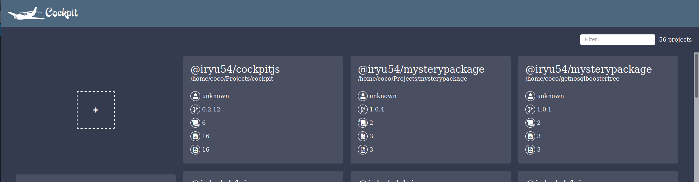
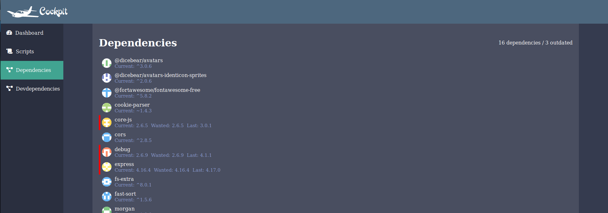

# cockpit
(WIP)
Manage NPM projects across your filesystem

## Install
``` bash 
npm i -g @iryu54/cockpitjs
```
Or clone this project and 
``` bash 
npm i -g
```

## Usage
``` bash
cockpit
```

## Screenshots
Projects:


Project:


## TODO
 -  Update outdated projects
 -  Check vulnerabilities
 -  Explain vulnerabilities if possible
